# Práctica 1. Sistema de pago para un e-commerce

## Índice
1. [Intro](#1-intro)
2. [Estructura de clases](#2-estructura-de-clases)
    - [Diagrama de clases UML](#diagrama-de-clases-uml)
    - [Código de PlantUML](#c%C3%B3digo-de-plantuml)
    - [Contenido de las clases .java](#contenido-de-las-clases-java)
3. [Programa principal (app)](#3-programa-principal-app)
4. [Pruebas](#4-pruebas)
5. [Entrega](#5-entrega)

### 1. Intro
  > En esta práctica creamos una app para un sistema de pagos online. Al entrar en la tienda se nos pregunta que método de pago queremos usar entre 3 opciones. Bizum, Paypal y Tarjeta de crédito. Dependiendo de lo que elijamos pasaremos a validar el método de pago.
   >  - Bizum: validamos el número de teléfono asociado y el pin.
   >  - Paypal: validamos el formato de la cuenta asociada a paypal, y que el saldo de la cuenta sea suficiente.
   >  - Tarjeta de crédito: validamos el número de la tarjeta y el tipo.
<br>

### 2. Estructura de clases

#### Diagrama de clases UML
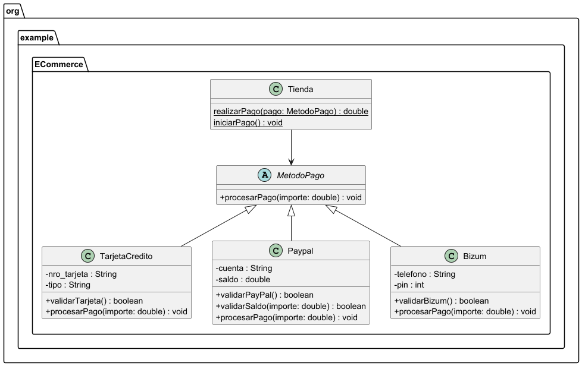

#### Código de PlantUML

````
@startuml
skinparam classAttributeIconSize 0
package org.example.ECommerce {

    abstract class MetodoPago {
        +procesarPago(importe: double) : void
    }

    class TarjetaCredito {
        -LONGITUD_NRO_TARJETA : int
        -tiposValidos : String[]
        -nro_tarjeta : String
        -tipo : String
        +TarjetaCredito(nro_tarjeta: String, tipo: String)
        +validarTarjeta() : boolean
        +procesarPago(importe: double) : void

    }

    class Paypal {
        -FORMATO_CUENTA : String
        -cuenta : String
        -saldo : double
        +Paypal(cuenta: String)
        +validarPayPal() : boolean
        +validarSaldo(importe: double) : boolean
        +procesarPago(importe: double) : void
    }

    class Bizum {
        -LONGITUD_TELF : int
        -telefono : String
        -pin : int
        +Bizum(telefono: String)
        +validarBizum() : boolean
        +procesarPago(importe: double) : void
    }

    class Tienda {
        {static}realizarPago(pago: MetodoPago) : double
        {static}iniciarPago() : void
    }

    MetodoPago <|-- TarjetaCredito
    MetodoPago <|-- Paypal
    MetodoPago <|-- Bizum
    Tienda --> MetodoPago
}

@enduml

````

#### Contenido de las clases (.java)
- Clase abstracta MetodoPago.java
````
public abstract class MetodoPago {

    public abstract void procesarPago(double importe);
    
}
````
[Link a la clase en github](https://github.com/adrigeada/programacion_ud6/blob/main/programacion_ud6/src/main/java/org/example/ECommerce/MetodoPago.java)
<br>

- Clase Bizum.java
````
package org.example.ECommerce;

import java.util.Random;
import java.util.Scanner;

public class Bizum extends MetodoPago{
    private static Random aleatorio = new Random();
    private static Scanner teclado = new Scanner(System.in);
    private final int LONGITUD_TELF = 9;

    private String telefono;
    private int pin;

    public Bizum(String telefono){
        this.telefono = telefono;
        pin = setPin();
    }

    /**
     *Este método va a validar que el pin sea el mismo que se ha generado automáticamente y que el teléfono tenga 9 carácteres.
     * El teléfono es el que se ha dado en el constructor. El pin lo recibe por teclado.
     * @return true si las dos condiciones se cumplen. False si una de las dos no se cumple.
     */
    public boolean validarBizum(){
        System.out.println("Escribe el pin de Bizum");
        int pin = teclado.nextInt();
        teclado.nextLine();

        if (telefono.length()== LONGITUD_TELF && pin == this.pin){
            System.out.println("Bizum válido");
            return true;
        } else if (telefono.length() != LONGITUD_TELF) {
            System.out.println("Longitud de teléfono diferentes a "+LONGITUD_TELF);
            return false;
        }else {
            System.out.println("Pin incorrecto");
            return false;
        }
    }


    @Override
    public void procesarPago(double importe) {
        System.out.println("Procesando pago de importe "+importe+"€ con Bizum.");
    }

    public String getTelefono() {
        return telefono;
    }

    public void setTelefono(String telefono) {
        this.telefono = telefono;
    }

    public int getPin() {
        return pin;
    }

    /**
     * A este método se le llama desde el constructor. Lo que devuelve es el atributo pin.
     * Se crea un pin aleatorio de 6 números. Uso String para que concatenarlo sea más fácil y que los ceros puedan ser parte del pin.
     * Imprime el chivato del pin para poder hacer las pruebas.
     * @return pin de 6 dígitos pasado a int.
     */
    public int setPin() {

        String pinString = "";
        for (int i = 0; i < 6; i++) {
            pinString+=Integer.toString(aleatorio.nextInt(10));
        }
        System.out.println("PIN aleatorio: "+pinString);

        return Integer.parseInt(pinString);
    }

    @Override
    public String toString() {
        return "Bizum{" +
                "telefono='" + telefono + '\'' +
                ", pin=" + pin +
                '}';
    }
}

````
[Link a la clase en github](https://github.com/adrigeada/programacion_ud6/blob/main/programacion_ud6/src/main/java/org/example/ECommerce/Bizum.java)
<br>

- Clase Paypal.java
````
package org.example.ECommerce;

public class Paypal extends MetodoPago{
    private final String FORMATO_CUENTA= "^[A-Za-z0-9+_.-]+@[A-Za-z0-9+_.-]+.com$";

    private String cuenta;
    private double saldo;

    public Paypal(String cuenta){
        this.cuenta = cuenta;
        this.saldo = 23;
    }

    /**
     * Este método comprueba que la cuenta pasada con el constructor tenga el formato aceptado que hemos declarado con la constante FORMATO_CUENTA.
     * @return true si el formato coincide. False si no coincide.
     */
    public boolean validarPayPal(){

        if (cuenta.matches(FORMATO_CUENTA)){
            System.out.println("Cuenta válida");
            return true;
        }else {
            System.out.println("Formato de cuenta no válido");
            return false;
        }
    }

    /**
     * @param importe es la cantidad de dinero con la que vamos a comparar el saldo.
     * @return true si el importe es menor o igual al saldo (puede pagar). False si el importe es mayor (no tiene suficiente saldo).
     */
    public boolean validarSaldo(double importe){
        if (importe<=saldo){
            System.out.println("Saldo suficiente. Procesando pago de "+importe+"€. Nuevo saldo: "+(saldo-importe)+"€.");
            return true;
        }else {
            System.out.println("Saldo insuficiente para pagar "+importe+"€. Tu saldo actual es: "+saldo);
            return false;
        }
    }


    @Override
    public void procesarPago(double importe) {
        System.out.println("Procesando pago de importe "+importe+"€ con PayPal.");
    }

    public String getCuenta() {
        return cuenta;
    }

    public void setCuenta(String cuenta) {
        this.cuenta = cuenta;
    }

    public double getSaldo() {
        return saldo;
    }

    public void setSaldo(double saldo) {
        this.saldo = saldo;
    }

    @Override
    public String toString() {
        return "Paypal{" +
                "cuenta='" + cuenta + '\'' +
                ", saldo=" + saldo +
                '}';
    }
}

````
[Link a la clase en github](https://github.com/adrigeada/programacion_ud6/blob/main/programacion_ud6/src/main/java/org/example/ECommerce/Paypal.java)
<br>

- Clase TarjetaCredito.java
````
package org.example.ECommerce;

import java.util.Arrays;

public class TarjetaCredito extends MetodoPago{
    private final int LONGITUD_NRO_TARJETA = 16;
    private final String[] tiposValidos = {"VISA","MASTERCARD","MAESTRO"};

    private String nro_tarjeta;
    private String tipo;

    public TarjetaCredito(String nro_tarjeta,String tipo){
        this.nro_tarjeta = nro_tarjeta;
        this.tipo = tipo;
    }

    /**
     * Comprueba que el nro de tarjeta tenga la longitud adecuada (16 caracteres) y que el tipo sea válido, puede ser VISA, MASTERCARD, MAESTRO. En el metodo Tienda.iniciar pago, lo que se escriba se pasa a mayúsculas, para que coincida con los tipos.
     * @return true si la longitud y tipo válido. False si uno de los dos no es válido.
     */
    public boolean validarTarjeta(){
        if (nro_tarjeta.length() == LONGITUD_NRO_TARJETA && Arrays.asList(tiposValidos).contains(tipo)){
            System.out.println("Tarjeta válida");
            return true;
        } else if (nro_tarjeta.length() != LONGITUD_NRO_TARJETA) {
            System.out.println("La tarjeta tiene que tener 16 carácteres");
            return false;
        }else {
            System.out.println("El tipo de tarjeta no es válido");
            return false;
        }

    }


    @Override
    public void procesarPago(double importe) {
        System.out.println("Procesando pago de "+importe+"€ con tarjeta de crédito "+tipo);
    }

    public String getNro_tarjeta() {
        return nro_tarjeta;
    }

    public void setNro_tarjeta(String nro_tarjeta) {
        this.nro_tarjeta = nro_tarjeta;
    }

    public String getTipo() {
        return tipo;
    }

    public void setTipo(String tipo) {
        this.tipo = tipo;
    }

    @Override
    public String toString() {
        return "TarjetaCredito{" +
                "nro_tarjeta='" + nro_tarjeta + '\'' +
                ", tipo='" + tipo + '\'' +
                '}';
    }
}

````
[Link a la clase en github](https://github.com/adrigeada/programacion_ud6/blob/main/programacion_ud6/src/main/java/org/example/ECommerce/TarjetaCredito.java)
<br>

- Clase Tienda.java
````
package org.example.ECommerce;

import java.util.Scanner;

public class Tienda {
    private static Scanner teclado = new Scanner(System.in);

    /**
     * Recibe por teclado el importe a pagar.
     * @param pago, dependiendo de qué método de pago reciba este método, se ejecutará el correspondiente método abstracto procesarPago. Cada hija de MetodoPago tiene un procesarPago diferente.
     * @return solo se usa para Paypal. En este caso se devuelve el importe para que se compare con el saldo de la cuenta de Paypal. En los casos de Bizum y TarjetaCredito no se utiliza el return.
     */
    public static double realizarPago(MetodoPago pago){
        System.out.println("¿Cual es el importe a pagar?");
        double importe = teclado.nextDouble();
        teclado.nextLine();

        pago.procesarPago(importe);
        return importe;
    }

    /**
     *Se inserta por teclado el método de pago que queremos utilizar y se pasa a minúsculas. Dependiendo de cual hemos elegido cada caso del switch hará una cosa diferente.
     * - Bizum: recibe por teclado el telefono que se usa en el constructor. Si validarBizum es true se ejecuta realizarPago, si no se acaba el programa.
     * - Paypal: recibe por teclado la cuenta que se usa en el constructor. Si validarPaypal es true se le pasa realizarPago a validarSaldo para que se comparen el importe introducido en realizarPago con el saldo de paypal. Si es false, se acaba el programa.
     * - Tarjeta: Se piden el numero y el tipo de tarjeta, se usan en el constructor. Si validarTarjeta es true se ejecuta realizarPago, si no se acaba el programa.
     */
    public static void iniciarPago(){
        System.out.println("¿Qué método de pago vas a usar?[Bizum, Paypal, Tarjeta]");
        String eleccion = teclado.nextLine();

        switch (eleccion.toLowerCase()){

            case "bizum":
                System.out.println("Escribe tu número de telefono vinculado con Bizum:");
                String telf = teclado.nextLine();

                Bizum bizum = new Bizum(telf);

                if (bizum.validarBizum()){
                    realizarPago(bizum);
                    System.out.println("Pago aceptado. Muchas gracias.");
                }else {
                    System.out.println("Saliendo del programa...");
                }

                break;


            case "paypal":
                System.out.println("Escribe tu cuenta de Paypal:");
                String email = teclado.nextLine();

                Paypal paypal = new Paypal(email);

                if (paypal.validarPayPal()){

                    paypal.validarSaldo(realizarPago(paypal));

                }else {
                    System.out.println("Saliendo del programa...");
                }


                break;


            case "tarjeta":
                System.out.println("Introduce los datos de tu tarjeta:");
                String num = teclado.nextLine();
                System.out.println("Selecciona el tipo de tarjeta [VISA, MAESTRO, MASTERCARD]:");
                String tipo = teclado.nextLine().toUpperCase();
                TarjetaCredito tarjeta = new TarjetaCredito(num,tipo);

                if (tarjeta.validarTarjeta()){
                    realizarPago(tarjeta);
                    System.out.println("Pago aceptado. Muchas gracias");
                }else {
                    System.out.println("Los datos de tu tarjeta no son correctos. ");
                }


                break;

            default:
                System.out.println("El método de pago no existe");

        }


    }
}

````
[Link a la clase en github](https://github.com/adrigeada/programacion_ud6/blob/main/programacion_ud6/src/main/java/org/example/ECommerce/Tienda.java)
<br>

### 3. Programa principal (app)
````
package org.example.ECommerce;

public class App {
    static void main() {

        Tienda.iniciarPago();

    }
}

````
[Link a la clase en github](https://github.com/adrigeada/programacion_ud6/blob/main/programacion_ud6/src/main/java/org/example/ECommerce/App.java)

### 4. Pruebas
- Prueba de elegir un método de pago no válido<br>
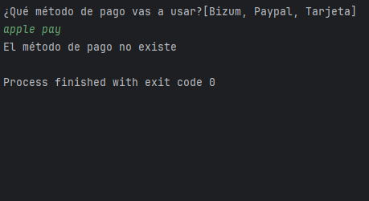<br><br>
- Prueba Bizum con datos correctos<br>
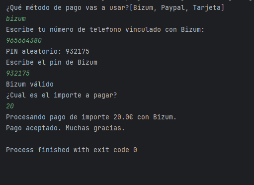<br><br>
- Prueba Bizum con número de teléfono diferente a 9 carácteres<br>
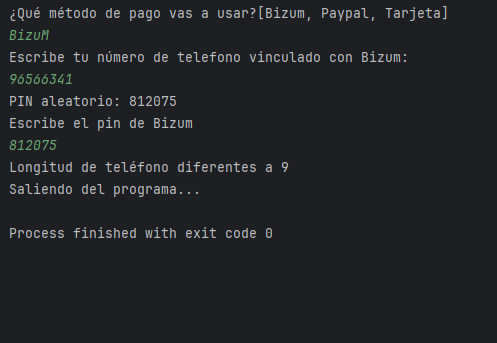<br><br>
- Prueba Bizum con PIN incorrecto<br>
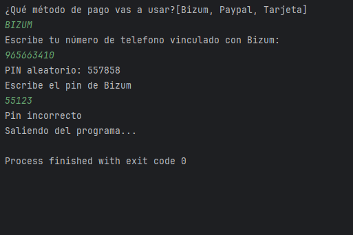<br><br>
- Prueba Paypal con datos correctos<br>
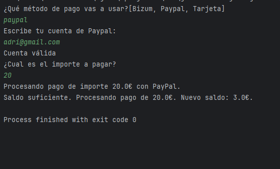<br><br>
- Prueba Paypal con el formato de la cuenta no válido<br>
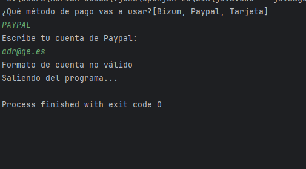<br><br>
- Prueba Paypal teniendo un saldo menor al importe<br>
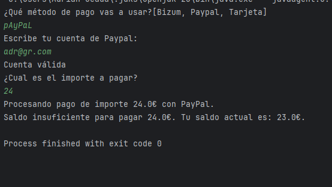<br><br>
- Prueba Tarjeta de crédito con datos correctos<br>
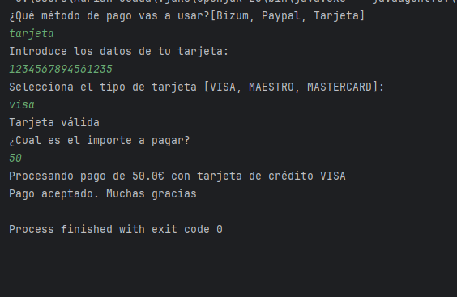<br><br>
- Prueba Tarjeta de crédito con un número de tarjeta diferente a 16 carácteres<br>
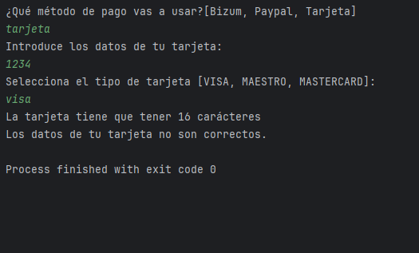<br><br>
- Prueba Tarjeta de crédito con un tipo de tarjeta no válido<br>
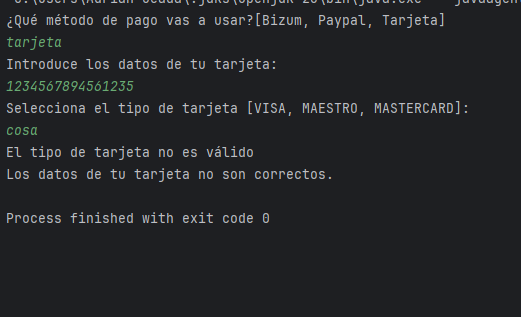<br><br>


### 5. Entrega

- [X] Código fuente en GitHub
- [X] Documentación
- [X] JavaDocs 


 
