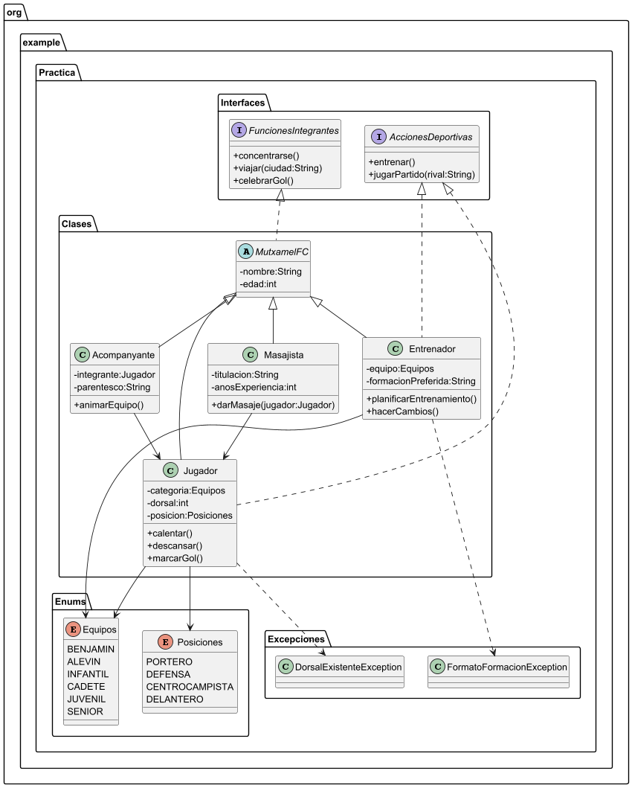

# Práctica 2. Modernización MutxamelFC

## Índice
1. [Intro](#1-intro)
2. [Estructura de clases](#2-estructura-de-clases)
    - [Diagrama de clases UML](#diagrama-de-clases-uml)
    - [Código de PlantUML](#c%C3%B3digo-de-plantuml)
    - [Contenido de las clases .java](#contenido-de-las-clases-java)
3. [Programa principal (app)](#3-programa-principal-app)
4. [Entrega](#4-entrega)

### 1. Intro
> En esta práctica creamos una app para la digitalización del club de fútbol de Mutxamel.
> Para las clases tenemos una clase madre abstracta llamada FCMutxamel. Sus hijos van a ser Jugador, Entrenador, Masajista y Acompanyante.
> También tenemos dos interfaces. FuncionesIntegrantes que implementa FCMutxamel y por ende, todos su hijos. Y AccionesDeportivas que implementa Jugador y Entrenador
> Tenemos dos clases Enum. Equipos guarda las distintas categorías de equipos y Posiciones guarda las diferentes posiciones en las que pueden jugar los jugadores.
> Por último hemos creado dos excepciones. DorsalExistenteExcepcion, que se activa cuando hay más de un jugador en el mismo equipo con el mismo número. Y FormatoFormacionExcepcion, que salta cuando la formación preferida de un entrenador no coincide con el formato permitido (N-N-N)
> En la programa principal (App) creamos un menú que permitirá elegir hacer mantenimiento de Jugadores, Entrenadores, Masajistas y enseñar los equipos presentes en el FCMutxamel. Para los jugadores se pueden añadir nuevos jugadores, modificarlos y crear acompañantes para los jugadores. Los entrenadores se podrán modificar. Los masajistas no se pueden controlar. 

<br>

### 2. Estructura de clases

#### Diagrama de clases UML 


#### Código de PlantUML

````
@startuml
skinparam classAttributeIconSize 0

package org.example.Practica.Interfaces {

    interface FuncionesIntegrantes {
        +concentrarse()
        +viajar(ciudad:String)
        +celebrarGol()
    }

    interface AccionesDeportivas {
        +entrenar()
        +jugarPartido(rival:String)
    }
}

package org.example.Practica.Enums {
    enum Equipos {
        BENJAMIN
        ALEVIN
        INFANTIL
        CADETE
        JUVENIL
        SENIOR
    }

    enum Posiciones {
        PORTERO
        DEFENSA
        CENTROCAMPISTA
        DELANTERO
    }
}

package org.example.Practica.Excepciones {
    class DorsalExistenteException
    class FormatoFormacionException
}

package org.example.Practica.Clases {

    abstract class MutxamelFC {
        -nombre:String
        -edad:int
    }

    class Jugador {
        -categoria:Equipos
        -dorsal:int
        -posicion:Posiciones
        +calentar()
        +descansar()
        +marcarGol()
    }

    class Entrenador {
        -equipo:Equipos
        -formacionPreferida:String
        +planificarEntrenamiento()
        +hacerCambios()
    }

    class Masajista {
        -titulacion:String
        -anosExperiencia:int
        +darMasaje(jugador:Jugador)
    }

    class Acompanyante {
        -integrante:Jugador
        -parentesco:String
        +animarEquipo()
    }
}


' =======================
' HERENCIA
' =======================
MutxamelFC <|-- Jugador
MutxamelFC <|-- Entrenador
MutxamelFC <|-- Masajista
MutxamelFC <|-- Acompanyante

' =======================
' IMPLEMENTACION INTERFACES
' =======================
FuncionesIntegrantes <|.. MutxamelFC
AccionesDeportivas <|.. Jugador
AccionesDeportivas <|.. Entrenador

' =======================
' RELACIONES
' =======================
Jugador --> Equipos
Jugador --> Posiciones
Entrenador --> Equipos
Acompanyante --> Jugador
Masajista --> Jugador

Jugador ..> DorsalExistenteException
Entrenador ..> FormatoFormacionException


@enduml
````

#### Contenido de las clases
- Clase abstracta FCMutxamel
````
package org.example.Practica.Clases;

import org.example.Practica.Interfaces.FuncionesIntegrantes;

public abstract class MutxamelFC implements FuncionesIntegrantes {

    private String nombre;
    private int edad;

    public MutxamelFC(String nombre,int edad){
        this.nombre = nombre;
        this.edad = edad;
    }

    public String getNombre() {
        return nombre;
    }

    public void setNombre(String nombre) {
        this.nombre = nombre;
    }

    public int getEdad() {
        return edad;
    }

    public void setEdad(int edad) {
        this.edad = edad;
    }

    @Override
    public String toString() {
        return "Nombre=" + nombre +
                ", Edad=" + edad +
                ", ";
    }
}

````
[Link a la clase en gihub](https://github.com/adrigeada/programacion_ud6/blob/main/programacion_ud6/src/main/java/org/example/Practica/Clases/MutxamelFC.java)
<br>

- Clase Masajista
````
package org.example.Practica.Clases;

public class Masajista extends MutxamelFC{

    private String titulacion;
    private int anosExperiencia;

    public Masajista(String nombre, int edad,String titulacion,int anosExperiencia) {
        super(nombre, edad);
        this.titulacion = titulacion;
        this.anosExperiencia = anosExperiencia;
    }

    public String getTitulacion() {
        return titulacion;
    }

    public void setTitulacion(String titulacion) {
        this.titulacion = titulacion;
    }

    public int getAnosExperiencia() {
        return anosExperiencia;
    }

    public void setAnosExperiencia(int anosExperiencia) {
        this.anosExperiencia = anosExperiencia;
    }

    public void darMasaje (Jugador jugador){
        System.out.println("Masajeando las piernas robustas de "+jugador.getNombre());
    }

    @Override
    public String toString() {
        return "Masajista{" +super.toString()+
                "titulacion='" + titulacion + '\'' +
                ", anosExperiencia=" + anosExperiencia +
                '}';
    }

    @Override
    public void concentrarse() {
        System.out.println("Preparandose para asistir en las lesiones de los jugadores");
    }

    @Override
    public void viajar(String ciudad) {
        System.out.println("Viajando a "+ciudad+" con el equipo para hacer masajes");
    }

    @Override
    public void celebrarGol() {
        System.out.println("Celebrando el gol con los lesionados del banquillo. ");
    }
}

````
[Link a la clase en github](https://github.com/adrigeada/programacion_ud6/blob/main/programacion_ud6/src/main/java/org/example/Practica/Clases/Masajista.java)
<br>

- Clase Acompañante
````
package org.example.Practica.Clases;

public class Acompanyante extends MutxamelFC{

    private Jugador integrante;
    private String parentesco;

    public Acompanyante(String nombre, int edad,Jugador integrante,String parentesco) {
        super(nombre, edad);
        this.integrante = integrante;
        this.parentesco = parentesco;
    }

    public Jugador getIntegrante() {
        return integrante;
    }

    public void setIntegrante(Jugador integrante) {
        this.integrante = integrante;
    }

    public String getParentesco() {
        return parentesco;
    }

    public void setParentesco(String parentesco) {
        this.parentesco = parentesco;
    }

    public void animarEquipo(){
        System.out.println("Animando muy fuerte a mi equipo favorito");
    }

    @Override
    public String toString() {
        return "Acompanyante{" +super.toString()+
                "integrante=" + integrante +
                ", parentesco='" + parentesco + '\'' +
                '}';
    }

    @Override
    public void concentrarse() {
        System.out.println("Preparandose para gritar muy fuerte");
    }

    @Override
    public void viajar(String ciudad) {
        System.out.println("Viajando a "+ciudad+" para animar a su equipo");
    }

    @Override
    public void celebrarGol() {
        System.out.println("GOOOOLASOOOOO ESPECTACULAAAAAR");
    }
}

````
[Link a la clase en github](https://github.com/adrigeada/programacion_ud6/blob/main/programacion_ud6/src/main/java/org/example/Practica/Clases/Acompanyante.java)
<br>

- Clase Entrenador
````
package org.example.Practica.Clases;

import org.example.Practica.App;
import org.example.Practica.Enums.Equipos;
import org.example.Practica.Excepciones.FormatoFormacionException;
import org.example.Practica.Interfaces.AccionesDeportivas;

import java.util.ArrayList;
import java.util.Scanner;

public class Entrenador extends MutxamelFC implements AccionesDeportivas {
    private final String FORMATO_FORMACION = "\\d-\\d-\\d";
    private static Scanner teclado = new Scanner(System.in);

    private Equipos equipo;
    private String formacionPreferida;

    public Entrenador(String nombre, int edad,Equipos equipo) {
        super(nombre, edad);
        this.equipo = equipo;
        setFormacionPreferida();
    }

    public Equipos getEquipo() {
        return equipo;
    }

    public void setEquipo(Equipos equipo) {
        this.equipo = equipo;
    }

    public String getFormacionPreferida() {
        return formacionPreferida;
    }

    /**
     * Se pide la formacion preferida por teclado, y se comprueba que tenga el formato necesario usando matches. Si no lo tiene se activa una excepción personalizada que capturamos con el try catch. Si el formato está bien, se asigna la formacion al Entrenador creado.
     */
    public void setFormacionPreferida() {
        boolean control = false;

        do {
            control=false;
            System.out.println("Cual es la formación preferida de "+getNombre()+" [N-N-N]");
            String formacion = teclado.nextLine();
            try {

                if (formacion.matches(FORMATO_FORMACION)){
                    formacionPreferida = formacion;
                }else {
                    throw new FormatoFormacionException();
                }

            }catch (FormatoFormacionException e){
                System.out.println("El formato de la formacion no coincide con el indicado");
                control = true;
            }


        }while(control);

    }

    /**
     * Insertas por teclado lo que quieres modificar del entrenador seleccionado. Segun el atributo que elijas, hace un set para ese atributo.
     * @param entrenador seleccionado en el método elegirEntrenador()
     */
    public void modificarEntrenador(Entrenador entrenador){
        System.out.println("\nModificando "+entrenador);
        System.out.println("\nQue quieres modificar [nombre,edad,equipo,formacion]");
        String modificar = teclado.nextLine().toLowerCase();
        System.out.println("================================");

        switch (modificar){
            case "nombre":
                System.out.println("Nuevo nombre:");
                entrenador.setNombre(teclado.nextLine());
                break;
            case "edad":
                System.out.println("Nueva edad:");
                entrenador.setEdad(teclado.nextInt());
                break;
            case "equipo":
                System.out.println("Nuevo equipo:");
                entrenador.setEquipo(Equipos.valueOf(teclado.nextLine()));
                break;
            case "formacion":
                setFormacionPreferida();
                break;

            default:
                System.out.println("No es posible modificar "+modificar);

        }
    }


    public void planificarEntrenamiento(){
        System.out.println("Planeando el próximo entrenamiento para seguir ganando");
    }

    public void hacerCambios(){
        System.out.println("Cambiando a los jugadores que están jugando mal");
    }

    @Override
    public String toString() {
        return "Entrenador{" +super.toString()+
                "equipo=" + equipo +
                ", formacionPreferida='" + formacionPreferida + '\'' +
                '}';
    }

    @Override
    public void concentrarse() {
        System.out.println("Mascando chicle y pensando próxima jugada");
    }

    @Override
    public void viajar(String ciudad) {
        System.out.println("Viajando a "+ciudad+" con el equipo");
    }

    @Override
    public void celebrarGol() {
        System.out.println("No reacciona. Nada que celebrar.");
    }

    //=====ACCIONES DEPORTIVAS ===============

    @Override
    public void entrenar() {
        System.out.println("Gritando a los jugadores para que corran más rápido");
    }

    @Override
    public void jugarPartido(String rival) {
        System.out.println("Dando instrucciones para ganar contra "+rival);
    }
}

````
[Link a la clase en github](https://github.com/adrigeada/programacion_ud6/blob/main/programacion_ud6/src/main/java/org/example/Practica/Clases/Entrenador.java)
<br>

- Clase Jugador
````
package org.example.Practica.Clases;

import org.example.Practica.Enums.Equipos;
import org.example.Practica.Enums.Posiciones;
import org.example.Practica.Excepciones.DorsalExistenteException;
import org.example.Practica.Interfaces.AccionesDeportivas;

import java.util.ArrayList;
import java.util.Scanner;

public class Jugador extends MutxamelFC implements AccionesDeportivas {
    static Scanner teclado = new Scanner(System.in);

    private Equipos categoria;
    private int dorsal;
    private Posiciones posicion;


    public Jugador(String nombre, int edad,Equipos categoria,Posiciones posicion,ArrayList<Jugador> listaMutxa) {
        super(nombre, edad);
        this.categoria = categoria;
        setDorsal(listaMutxa);
        this.posicion = posicion;
    }

    public Equipos getCategoria() {
        return categoria;
    }

    public void setCategoria(Equipos categoria) {
        this.categoria = categoria;
    }

    public int getDorsal() {
        return dorsal;
    }

    /**
     * Se pide el dorsal por teclado. Se recorre la lista de jugadores comprobando que nadie del mismo equipo (categoría) tenga ya asignado ese dorsal. Si una de esas condiciones se cumple, se lanza una excepción personalizada que capturamos con el try catch. Si no se cumplen, el dorsal se asigna al Jugador creado.
     * @param listaMutxa lista de jugadores creada en el main.
     */
    public void setDorsal(ArrayList<Jugador> listaMutxa) {
        boolean control = false;

        do {
            control = false;
            System.out.println("Cual es el dorsal del jugador "+super.getNombre());
            int dorsal = teclado.nextInt();
            teclado.nextLine();

            if (listaMutxa.isEmpty()){
                this.dorsal = dorsal;
            }else {

                try {
                    for (Jugador jugador : listaMutxa){
                        if (jugador.dorsal == dorsal && jugador.getCategoria()== categoria){
                            throw new DorsalExistenteException();
                        }
                    }
                    this.dorsal = dorsal;

                }catch (DorsalExistenteException e){
                    System.out.println("Otro jugador ya tiene ese dorsal");
                    control = true;
                }

            }

        }while (control);

    }

    /**
     * Se inserta por teclado el atributo que quieres modificar del jugador pasado como parámetro. Según lo insertado se hace el set necesario
     * @param jugador jugador modificado
     * @param listaMutxa lista de jugadores para pasar a setDorsal()
     */
    public void modificarJugador(Jugador jugador,ArrayList<Jugador> listaMutxa){

        System.out.println("\nQue quieres modificar? [nombre,edad,categoria,dorsal,posicion]");
        String modificar = teclado.nextLine();

        switch (modificar){
            case "nombre":
                System.out.println("Nuevo nombre:");
                jugador.setNombre(teclado.nextLine());
                break;
            case "edad":
                System.out.println("Nueva edad:");
                jugador.setEdad(teclado.nextInt());
                teclado.nextLine();
                break;
            case "categoria":
                System.out.println("Nueva categoría: [BENJAMIN,ALEVIN,INFANTIL,CADETE,JUVENIL,SENIOR]");
                try{
                    jugador.setCategoria(Equipos.valueOf(teclado.next().toUpperCase()));
                }catch (IllegalArgumentException e){
                    System.out.println("No es una categoría válida");
                }
                teclado.nextLine();
                break;
            case "dorsal":
                jugador.setDorsal(listaMutxa);

                break;
            case "posicion":
                System.out.println("Nueva posicion: [PORTERO,DEFENSA,CENTROCAMPISTA,DELANTERO]");
                try{
                    jugador.setPosicion(Posiciones.valueOf(teclado.next().toUpperCase()));
                }catch (IllegalArgumentException e){
                    System.out.println("No es una posicion válida.");
                }
                break;
            default:
                System.out.println("No es posible modificar "+modificar);
        }

    }

    public void calentar(){
        System.out.println("Haciendo un par de carreritas para calentar los músculos");
    }

    public void descansar(){
        System.out.println("Descansando en el banquillo para no lesionarse");
    }

    public void marcarGol(){
        System.out.println("Chutando a puerta!!" +
                "");
    }

    public Posiciones getPosicion() {
        return posicion;
    }

    public void setPosicion(Posiciones posicion) {
        this.posicion = posicion;
    }

    @Override
    public String toString() {
        return "Jugador=[" + super.toString()+
                "Categoria=" + categoria +
                ", dorsal=" + dorsal +
                ", posicion=" + posicion +
                "] ";
    }

    @Override
    public void concentrarse() {
        System.out.println("Preparandose para jugar el partido");
    }

    @Override
    public void viajar(String ciudad) {
        System.out.println("Viajando a "+ciudad+" para jugar el partido");
    }

    @Override
    public void celebrarGol() {
        System.out.println("Deslizandose sobre las rodillas en el corner.");
    }

    //=======ACCIONES DEPORTIVAS=================

    @Override
    public void entrenar() {
        System.out.println("Practicando jugadas y entrenando cardio");
    }

    @Override
    public void jugarPartido(String rival) {
        System.out.println("Jugando partido contra "+rival);
    }
}

````
[Link a la clase en github](https://github.com/adrigeada/programacion_ud6/blob/main/programacion_ud6/src/main/java/org/example/Practica/Clases/Jugador.java)
<br>

- Clase enum Equipos
````
package org.example.Practica.Enums;

public enum Equipos {
    BENJAMIN,ALEVIN,INFANTIL,CADETE,JUVENIL,SENIOR;
}

````
[Link a la clase en github](https://github.com/adrigeada/programacion_ud6/blob/main/programacion_ud6/src/main/java/org/example/Practica/Enums/Equipos.java)
<br>

- Clase enum Posiciones
````
package org.example.Practica.Enums;

public enum Posiciones {
    PORTERO,DEFENSA,CENTROCAMPISTA,DELANTERO;
}

````
[Link a la clase en github](https://github.com/adrigeada/programacion_ud6/blob/main/programacion_ud6/src/main/java/org/example/Practica/Enums/Posiciones.java)
<br>

- Clase excepción DorsalExistenteException
````
package org.example.Practica.Excepciones;

public class DorsalExistenteException extends RuntimeException {
    public DorsalExistenteException() {
        super("Ya hay un jugador con ese dorsal.");
    }
}

````
[Link a la clase en github](https://github.com/adrigeada/programacion_ud6/blob/main/programacion_ud6/src/main/java/org/example/Practica/Excepciones/DorsalExistenteException.java)
<br> 

- Clase excepción FormatoFormacionException
````
package org.example.Practica.Excepciones;

public class FormatoFormacionException extends RuntimeException {
    public FormatoFormacionException() {
        super();
    }
}

````
[Link a la clase en github](https://github.com/adrigeada/programacion_ud6/blob/main/programacion_ud6/src/main/java/org/example/Practica/Excepciones/FormatoFormacionException.java)
<br>

- Clase interfaz AccionesDeportivas
````
package org.example.Practica.Interfaces;

public interface AccionesDeportivas {
    void entrenar();
    void jugarPartido(String rival);
}

````
[Link a la clase en gihub](https://github.com/adrigeada/programacion_ud6/blob/main/programacion_ud6/src/main/java/org/example/Practica/Interfaces/AccionesDeportivas.java)
<br>

- Clase interfaz FuncionesIntegrantes
````
package org.example.Practica.Interfaces;

public interface FuncionesIntegrantes {
    void concentrarse();
    void viajar(String ciudad);
    void celebrarGol();
}

````
[Link a la clase en github](https://github.com/adrigeada/programacion_ud6/blob/main/programacion_ud6/src/main/java/org/example/Practica/Interfaces/FuncionesIntegrantes.java)
<br>

### 3. Programa principal (App)
````
package org.example.Practica;

import org.example.Practica.Clases.*;
import org.example.Practica.Enums.Equipos;
import org.example.Practica.Enums.Posiciones;

import java.util.ArrayList;
import java.util.Scanner;

public class App {
    static ArrayList<Jugador> listaJugadores = new ArrayList<>();
    static ArrayList<MutxamelFC> lista_muxta = new ArrayList<>();
    static Scanner teclado = new Scanner(System.in);
    static void main() {

        Jugador adri = new Jugador("Adrian",27, Equipos.SENIOR,Posiciones.PORTERO, listaJugadores);
        listaJugadores.add(adri);
        Jugador pepe = new Jugador("Pepe",30,Equipos.SENIOR,Posiciones.CENTROCAMPISTA,listaJugadores);
        listaJugadores.add(pepe);
        Jugador juan = new Jugador("Juan",20,Equipos.SENIOR,Posiciones.DELANTERO,listaJugadores);
        listaJugadores.add(juan);

        Entrenador lucas = new Entrenador("Lucas",50,Equipos.SENIOR);
        lista_muxta.add(lucas);
        Entrenador carlos = new Entrenador("Carlos",40,Equipos.ALEVIN);
        lista_muxta.add(carlos);

        Masajista marcos = new Masajista("Marcos",31,"Fisioterapia",5);
        lista_muxta.add(marcos);

        Acompanyante pepi = new Acompanyante("Pepi",20,pepe,"Hermana");
        lista_muxta.add(pepi);

   

        adri.concentrarse();
        lucas.entrenar();
        marcos.darMasaje(adri);
        pepi.viajar("Valencia");
        carlos.planificarEntrenamiento();
        lucas.entrenar();
        pepe.descansar();
        pepe.calentar();
        juan.jugarPartido("Betis");
        pepi.animarEquipo();
        lucas.hacerCambios();
        adri.marcarGol();
        marcos.celebrarGol();
        lucas.viajar("Mutxamel");
        adri.descansar();


        imprimirMenu();
        elegirmenu();


    }

    /**
     * Lo uso para repetir los menus sin tener que volver al main y crear los objetos otra vez
     */
    public static void minimain(){
        imprimirMenu();
        elegirmenu();
    }

    /**
     * Imprime el menú principal
     */
    public static void imprimirMenu(){
        System.out.println("=== App de mantenimiento del MUTXAMEL FC ===");
        System.out.println("\n    [1]. Mantenimiento de jugadores");
        System.out.println("    [2]. Mantenimiento de entrenadores");
        System.out.println("    [3]. Mantenimiento masajistas");
        System.out.println("    [4]. Consultar equipos");
        System.out.println("    [X]. Salir");
        System.out.println("\n=============================");
        System.out.println("Selecciona una opción");
    }

    /**
     * El switch case del menú principal.
     */
    public static void elegirmenu(){
        String opcion = teclado.nextLine();

        switch (opcion){
            case "1":
                menuJugadores();
                break;
            case "2":
                elegirEntrenador();
                break;
            case "3":
                System.out.println("Trabajando en ello...");
                break;
            case "4":
                consultarEquipos();
                break;
            default:
                System.out.println("Saliendo del programa...");
        }
    }

    /**
     * Imprime el menú de los jugadores
     */
    public static void menuJugadores(){
        System.out.println("=== Mantenimiento de Jugadores ===");
        System.out.println("\n    [1]. Añadir nuevo jugador");
        System.out.println("    [2]. Modificar datos de jugador existente");
        System.out.println("    [3]. Crear acompañantes (solo seniors)");
        System.out.println("    [X]. Volver al menú principal");
        System.out.println("==============================");
        System.out.println("Selecciona una opción:");
        opcionJugadores();
    }

    /**
     * Switch case para el menú de jugadores
     */
    public static void opcionJugadores(){
        String opcion = teclado.nextLine();

        switch (opcion){
            case "1":
                anyadirJugador();
                menuJugadores();
                break;
            case "2":
                elegirJugador(listaJugadores);
                menuJugadores();
                break;
            case "3":
                anyadirAcompanyante();
                menuJugadores();
                break;
            default:
                minimain();
        }

    }

    /**
     * Pide por teclado los atributos del jugador a añadir y los guarda en variables. Luego crea al Jugador y lo añade a la lista de Jugadores
     */
    public static void anyadirJugador(){
        Equipos equipo = null;
        Posiciones posicion = null;

        System.out.println("Nombre nuevo jugador:");
        String nombre = teclado.nextLine();

        System.out.println("Edad nuevo jugador:");
        int edad = teclado.nextInt();
        teclado.nextLine();

        boolean control = false;
        do {
            control = false;
            try {
                System.out.println("Equipo: [BENJAMIN,ALEVIN,INFANTIL,CADETE,JUVENIL,SENIOR]");
                equipo = Equipos.valueOf(teclado.nextLine().toUpperCase());
            }catch (IllegalArgumentException e){
                System.out.println("Equipo no válido");
                control = true;
            }

        }while (control);

        do {
            control = false;
            try {
                System.out.println("Posicion: [PORTERO,DEFENSA,CENTROCAMPISTA,DELANTERO]");
                posicion = Posiciones.valueOf(teclado.nextLine().toUpperCase());
            }catch (IllegalArgumentException e){
                System.out.println("Posición no válida");
                control = true;
            }
        }while (control);

        Jugador jugador = new Jugador(nombre,edad,equipo,posicion,listaJugadores);
        listaJugadores.add(jugador);
        System.out.println("Jugador añadido");

    }

    /**
     * Te enseña los Jugadores que hay en la lista de Jugadores. Luego eliges por nombre al jugador que quieres modificar. Si hay un jugador con ese nombre se llama al método modificarJugador() con ese Jugador con el que coincide el nombre
     * @param listaMutxa lista de Jugadores
     */
    public static void elegirJugador (ArrayList<Jugador> listaMutxa){
        boolean control = false;
        System.out.println("\nQue jugador quieres modificar?");

        for (Jugador jugador : listaMutxa){
            System.out.println("- "+jugador);
        }
        String modificar = teclado.nextLine();

        for (Jugador jugador : listaMutxa){
            if (modificar.equalsIgnoreCase(jugador.getNombre())){

                System.out.println("\nModificando al "+jugador);
                System.out.println("====================================");
                jugador.modificarJugador(jugador,listaMutxa);
                control = true;
            }

        }

        if (!control){
            System.out.println("No hay jugadores con nombre "+modificar);
        }


    }

    /**
     * Se selecciona al jugador con su nombre, que quiere añadir un acompañante. Si hay un jugador con ese nombre y pertenece al equipo SENIOR, se llama al método crearAcompañante() usando a ese Jugador como parámetro
     */
    public static void anyadirAcompanyante(){
        boolean control = false;
        System.out.println("Qué jugador quiere añadir un acompañante?");
        for (Jugador jugador : listaJugadores){
            System.out.println("- "+jugador.getNombre());
        }

        String nombre_jugador = teclado.nextLine();
        for (Jugador jugador : listaJugadores){
            if (nombre_jugador.equalsIgnoreCase(jugador.getNombre()) && jugador.getCategoria().equals(Equipos.SENIOR)){
                crearAcompanyante(jugador);
               control= true;
            }
        }
        if (!control){
            System.out.println("No hay jugadores con nombre: "+nombre_jugador+" en el equipo SENIOR");
        }

    }

    /**
     * Se piden los atributos del nuevo acompañante por teclado y se usan para crearlo.
     * @param jugador SENIOR al que acompaña el nuevo acompañante
     */
    public static void crearAcompanyante(Jugador jugador){
        System.out.println("Nombre del acompañante:");
        String nombre = teclado.nextLine();

        System.out.println("Edad acompañante:");
        int edad = teclado.nextInt();
        teclado.nextLine();

        System.out.println("Que parentesco tiene con "+jugador.getNombre()+" ?");
        String parentesco = teclado.nextLine();

        Acompanyante acompanyante = new Acompanyante(nombre,edad,jugador,parentesco);
        lista_muxta.add(acompanyante);
        System.out.println("Acompañante para el jugador "+jugador.getNombre()+" creado.");
    }


    /**
     * Se muestra la lista de personal. De esa lista se enseñan solo los que sean Entrenadores. Se ingresa por teclado el nombre del entrenador que se quiere modificar. Si hay un entrenador con ese nombre se llama al método modificarEntrenador().
     */
    public static void elegirEntrenador(){
        boolean control = false;
        System.out.println("Que entrenador quieres modificar?");
        for (MutxamelFC personal : lista_muxta){
            if (personal instanceof Entrenador){
                System.out.println(personal);
            }
        }
        String nombre = teclado.nextLine();
        for (MutxamelFC personal : lista_muxta){
            if (personal instanceof Entrenador){

                if (nombre.equalsIgnoreCase(personal.getNombre())){
                    ((Entrenador) personal).modificarEntrenador((Entrenador) personal);
                    control = true;
                }

            }
        }
        if (!control){
            System.out.println("No hay ningun entrenador con nombre: "+nombre);
            minimain();
        }


    }

    /**
     * Enseña los equipos que hay en la clase enum EQUIPOS usando values. Luego se ingresa por teclado al equipo que se quiere animar. Se repite si ingresas un nombre que no coincide con los del enum.
     */
    public static void consultarEquipos(){
        System.out.println("Estos son nuestros equipos:");
        for (Equipos equipo : Equipos.values()){
            System.out.println(equipo);
        }

        boolean control = false;

        do {
            try {
                control = false;
                System.out.println("\n=====================");
                System.out.println("Que equipo quieres animar?");
                Equipos animar = Equipos.valueOf(teclado.nextLine().toUpperCase());
                System.out.println("\n AUPA "+animar.name()+"!!!");
            }catch (IllegalArgumentException e){
                System.out.println("Asegurate de escribir bien el nombre del equipo");
                control = true;
            }
        }while (control);

        minimain();

    }

}

````
[Link a la clase en github](https://github.com/adrigeada/programacion_ud6/blob/main/programacion_ud6/src/main/java/org/example/Practica/App.java)
<br>


### 4. Entrega

- [X] Código fuente en GitHub
- [X] Documentación
- [X] JavaDocs
- [X] Vídeo

